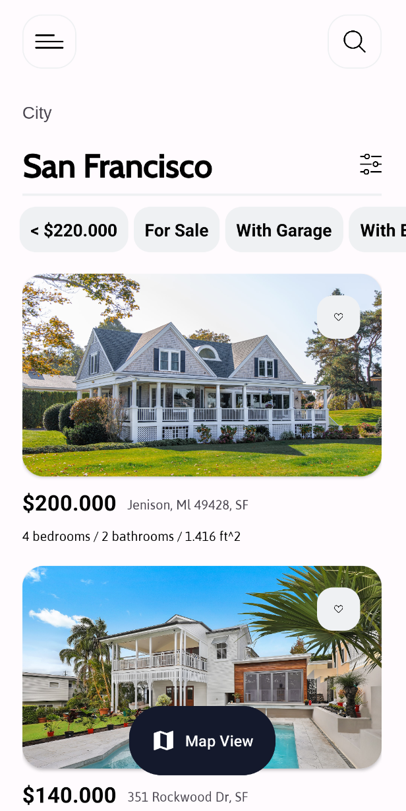
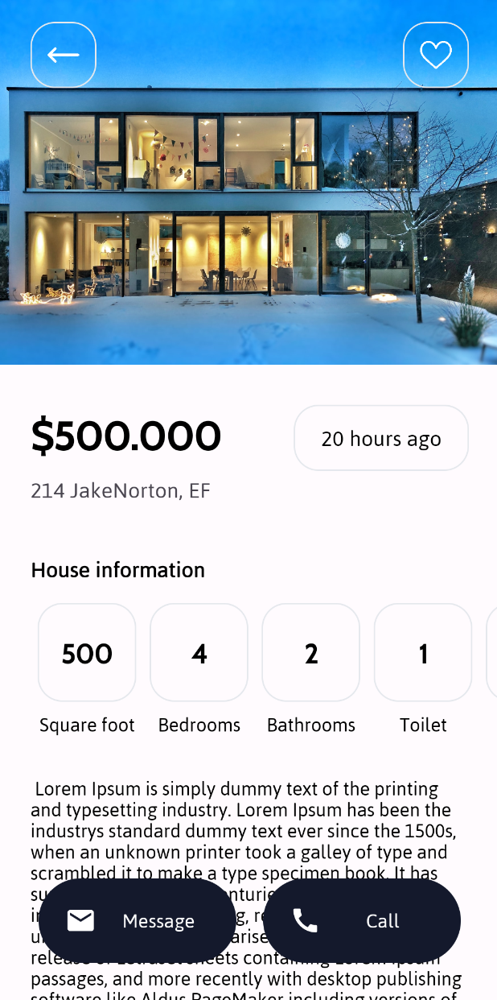

# miniProject

miniProject is a small Android real-estate UI project built with Kotlin, XML layouts, AppCompat, ConstraintLayout, Material Components, and RecyclerView. It shows a property listing page with filters and a detail page for each house.

## Screenshots

<p align="center">
  
  
</p>

## Features

- Classic Android XML UI implementation.
- Home/listing screen for houses in San Francisco.
- Horizontal filter chips for price, sale status, garage, elevator, pool, and bedrooms.
- Vertical RecyclerView list of house cards.
- Static sample property data with image, price, address, bedroom count, bathroom count, and area.
- Detail screen opened from a selected property card.
- Detail header image, price, address, house information list, description, back button, favorite icon, and Call/Message buttons.
- Horizontal house-info RecyclerView for square footage, bedrooms, bathrooms, toilet, garage, and elevator values.
- Custom fonts, colors, rounded backgrounds, and bundled drawable assets.

## Tech Stack

- Kotlin
- Android XML layouts
- AppCompat
- ConstraintLayout
- RecyclerView
- Material Components
- Gradle Kotlin DSL

## Project Structure

```text
miniProject/
├── app/src/main/java/com/alirahimi/miniproject
│   ├── ui/main
│   │   ├── MainActivity.kt
│   │   ├── adapters/FilterAdapter.kt
│   │   ├── adapters/HouseAdapter.kt
│   │   └── models/HouseModel.kt
│   ├── ui/detail
│   │   ├── DetailActivity.kt
│   │   ├── adapter/HouseInfoAdapter.kt
│   │   └── model/HouseInfo.kt
│   └── util/Constants.kt
├── app/src/main/res/layout
│   ├── activity_main.xml
│   ├── activity_detail.xml
│   ├── row_filter_list.xml
│   ├── row_house_list.xml
│   └── row_houses_info.xml
└── app/src/main/res/drawable
    └── House photos, icons, and rounded background drawables
```

## Main Flow

1. `MainActivity` creates a static filter list and a static house list.
2. `FilterAdapter` renders the horizontal filter row.
3. `HouseAdapter` renders house cards and opens `DetailActivity` when a card is tapped.
4. `DetailActivity` receives the selected house image, price, and address through intent extras.
5. `HouseInfoAdapter` renders extra property details on the detail page.

## Getting Started

1. Clone the repository.
2. Open the `miniProject` folder in Android Studio.
3. Sync Gradle.
4. Run the `app` configuration on an Android device or emulator.

## Build

```bash
cd miniProject
./gradlew assembleDebug
```

## Notes

This is a compact UI practice project with local/static data only. It does not include networking, authentication, maps integration, favorites persistence, or real call/message actions.
